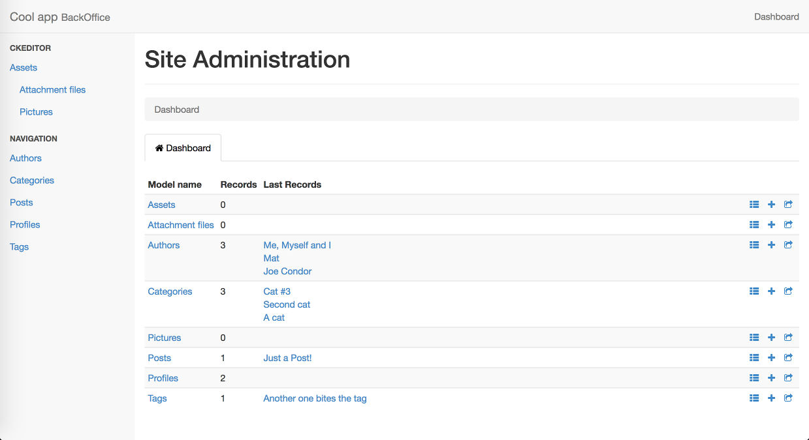

# RailsAdminMydash [](https://badge.fury.io/rb/rails_admin_mydash)

A [rails_admin](https://github.com/sferik/rails_admin) alternative dashboard. It overrides the default dashboard component.

Features:

- last 3 records for each model (useful to reach the last items easily)

- Google Analytics widget embed if enabled

- admin notices if enabled (to show informations to the users)

- auditing / history table if enabled

- no breadcrump and nav tabs on the dashboard

- no counters progress bars (minor performance improvement)

Demo: [heroku app](http://rails-admin-material.herokuapp.com/admin/)

## Installation

- Add the gem to Gemfile (**after** rails_admin gem): `gem 'rails_admin_mydash'`

- Execute `bundle`

## Google Analytics

This feature allows the access to Analytics data only after signing in with an enabled Google account.

To enable Google Analytics follow this guide: [Google Analytics Embed API](https://developers.google.com/analytics/devguides/reporting/embed/v1/getting-started)

- In [console](https://console.developers.google.com/project) create a new project

- In [console API](https://console.developers.google.com/apis/library) enable Analytics API

- In [console credentials](https://console.developers.google.com/apis/credentials) create an OAuth client ID, options: web application, authorized origins: add your admin host (es. http://www.myadmindomain.abc)

- Insert the client ID in rails_admin config:

```ruby
# In config.actions block:
dashboard do
  ga_key 'XXX.apps.googleusercontent.com'
  ga_chart_id 'ga:YYYYYYYYY'
  ga_start_date '60daysAgo'
  ga_end_date '30daysAgo'
  ga_metrics 'ga:sessions,ga:pageviews'
end
```

Options:

- ga_key: required - CLIENT_ID parameter (obtained from [Google API Client Libraries](https://developers.google.com/api-client-library/javascript/start/start-js#Setup) - [ID client OAuth 2.0](https://console.developers.google.com/apis/credentials))

- ga_chart_id: optional - chart to show, if not specified the selector is shown

- ga_start_date: optional - starting date, default: '30daysAgo'

- ga_end_date: optional - ending date, default: 'yesterday'

- ga_metrics: optional - type of data to show, default: 'ga:sessions'

## Admin notices

- Create and apply a migration:

`rails g migration CreateAdminNotices message:string published:boolean`

- Create a model AdminNotice

- Enable the option in rails_admin config:

```ruby
# In config.actions block:
dashboard do
  admin_notices 'AdminNotice'
end
```

- Add some messages: `AdminNotice.new( message: 'Just a test', published: true ).save`

## Options

- *admin_notices* [String]: model to use to show admin messages

- *ga_key* [String], *ga_chart_id* [String], *ga_start_date* [String], *ga_end_date* [String], *ga_metrics* [String]: see Google Analytics section above

- *last_records* [Integer]: number of records to show per model

- *models* [String array]: list of models to show (es. `['Category', 'Post', 'Tag']`)

## Notes

- For each record to show a *name* field or method is used

## Preview



## Contributors

- [Mattia Roccoberton](http://blocknot.es) - creator, maintainer
