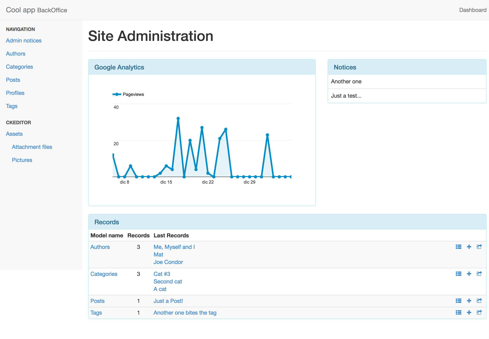

# RailsAdminMydash 

A rails_admin alternative dashboard.

Show the last 3 records for each model instead of the standard progress bar animation count.

## Installation

- Add the gem to Gemfile (after *rails_admin* gem): `gem 'rails_admin_mydash'`

- Execute `bundle`

## Preview

## Contributors

- [Mattia Roccoberton](http://blocknot.es) - creator, maintainer
